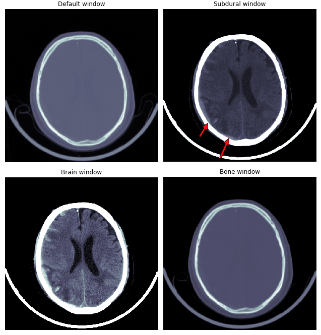
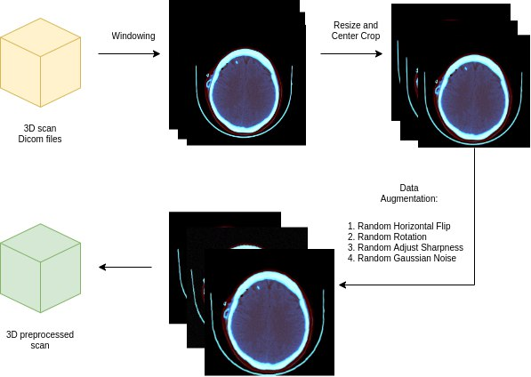
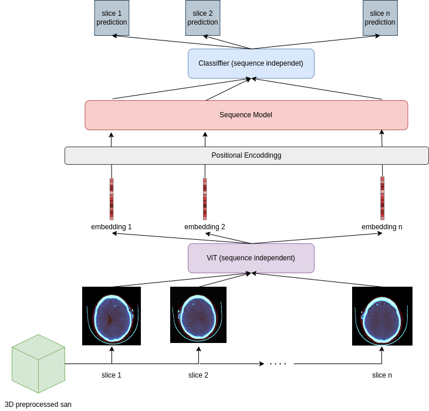
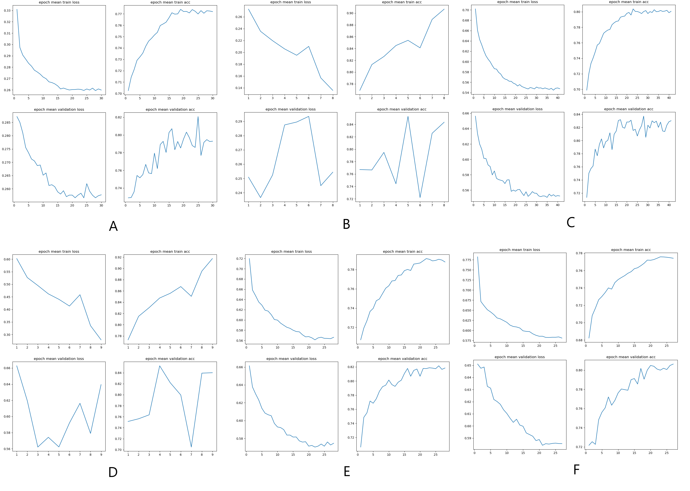

# Intracranial Hemorrhage Detection with Vision Transformers

Course project, COMP 691 Deep Learning, Concordia University (Winter 2022).
Team: Bahar Jahani, Amirhossein Rasoulian.

Intracranial hemorrhage (bleeding inside the skull) needs fast diagnosis from head CT scans. We fine-tuned a **Vision Transformer (ViT)** to detect hemorrhage in CT slices, then tested whether a second **transformer over the sequence of slices** (a 2.5D model) improves results.

📄 Full report: [docs/report.pdf](docs/report.pdf)

## Data and preprocessing

- **Dataset:** [RSNA Intracranial Hemorrhage Detection](https://kaggle.com/c/rsna-intracranial-hemorrhage-detection) (750,000+ DICOM slices). Slices were grouped into 3D scans by (study, series, patient) and sorted by image position: 25,000+ scans of 20–60 slices each.
- **Subset (~4% of the data):** 1,000 patient scans + 200 healthy scans, split 75/15/10 into train/validation/test with the same class ratio.

| Split | Patient scans | Healthy scans | Slices with hemorrhage | Slices without |
|---|---|---|---|---|
| Train | 750 | 150 | 9,300 | 21,308 |
| Validation | 150 | 30 | 1,650 | 4,497 |
| Test | 100 | 20 | 1,366 | 2,711 |

- **CT windowing:** 16-bit Hounsfield units mapped to three windows used as the three input channels: brain (W 80 / L 40), subdural (W 80 / L 200), bone (W 2800 / L 600).
- Resize to 400×400, center crop 348×348.
- **Augmentation (applied in the training loop):** horizontal flip, rotation ±5°, sharpness adjustment, Gaussian noise (σ = 0.02).

  
  

## Model

1. **2D slice model:** ViT-B pretrained on ImageNet-21k (fine-tuned on ImageNet-1k), 12 transformer layers, projecting each slice to a 128-d embedding, plus a classifier head.
2. **2.5D model:** the fine-tuned ViT embeds every slice of a scan; a transformer (encoder only, or encoder-decoder) models dependencies between slices; trained first with the ViT frozen, then end to end.

**Training:** class-weighted loss for the imbalance, cross-entropy vs binary cross-entropy, Adam vs **Sharpness-Aware Minimization (SAM)**, weight decay, ReduceLROnPlateau (start 1e-4), early stopping (patience 3), best-validation checkpoint.

## Results (slice-level test accuracy)

| Model | Optimizer | Loss | Batch | Accuracy |
|---|---|---|---|---|
| 2D ViT | SAM | CE | 32 | 81.57% |
| 2D ViT | Adam | CE | 32 | 81.21% |
| **2D ViT** | **SAM** | **BCE** | **32** | **85.06%** |
| 2D ViT | Adam | BCE | 32 | 81.21% |
| 2D ViT | SAM | BCE | 64 | 83.41% |
| 2D ViT | SAM | BCE | 128 | 82.68% |
| 2.5D ViT + transformer encoder | SAM | BCE | – | 82.07% |
| 2.5D ViT + encoder-decoder (greedy decoding) | SAM | BCE | – | 49.02% |

## What we learned

- **SAM** gave smoother train/validation curves and less overfitting than Adam with the same settings (85.1% vs 81.2% with BCE).
- **BCE with one output** worked better than CE with two outputs for this binary task.
- **The 2.5D model overfit:** stacking two transformers is very data-hungry and we used only ~4% of the data; scans have very different numbers of slices (20–60); and the encoder-decoder setup mapped continuous embeddings to only three target tokens. Next step from the report: train other combinations of slice feature extractors and sequence models on more data.

## Code

The training code was written in PyTorch on Google Colab. [Add notebooks here if available.]

## Authors

Bahar Jahani · [LinkedIn](https://www.linkedin.com/in/bahar-jahani-a711a81b3) · Amirhossein Rasoulian

*Figures include CT images from the RSNA Intracranial Hemorrhage Detection dataset, used for research and education.*
